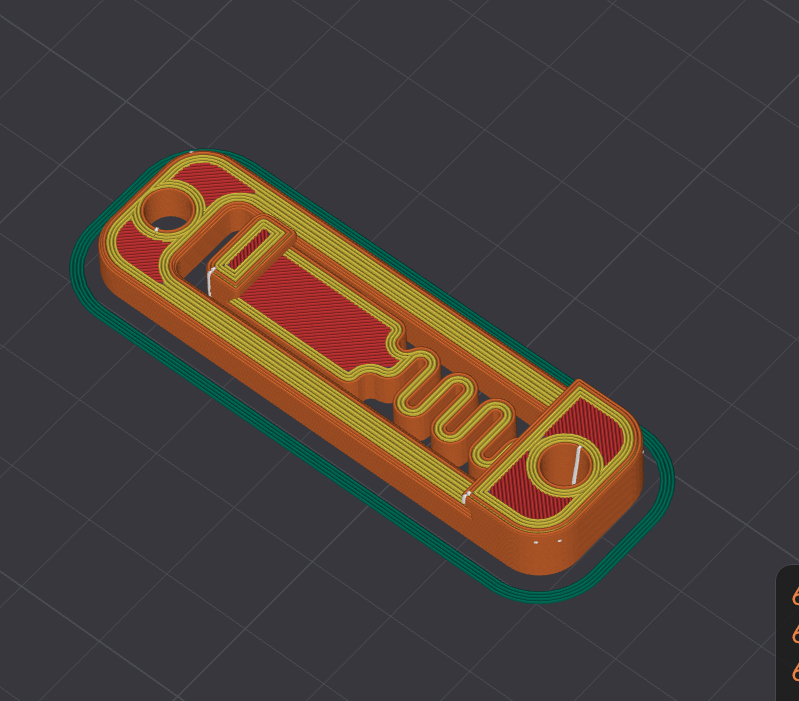
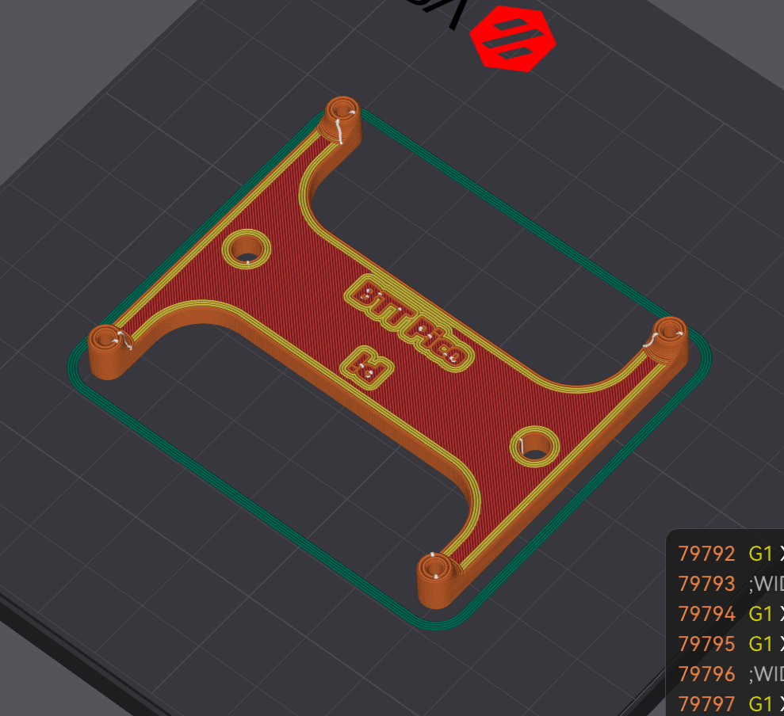
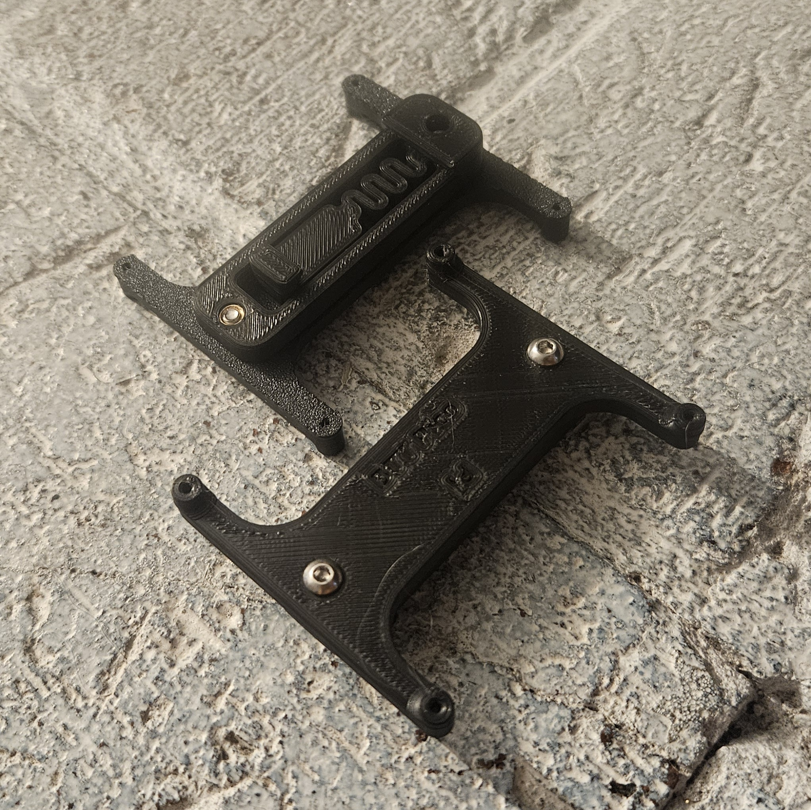

# DIN Mount for Voron V0.2

## Overview

The DIN Mount is a bracket system that allows for secure and reliable affixing of electronics to a DIN rail in a Voron V0.2 printer.

## Supported Components

- Raspberry Pi
- BTT Pico

## Specifications

- **Hole Spacing:** 51mm
- **Mount Type:** DIN rail compatible
- **Heat Set Inserts:** M3 (standard Voron)
- **Assembly Bolts:** 2x M3x8mm BHCS

## Files

### 3D Model Files

- `DIN_mount.stl` - DIN rail mounting base
- `RPi_or_BTT-Pico_Din_Mount.stl` - Electronics bracket (connects to DIN_mount.stl)
- `RPi_or_BTT-Pico_Din_Mount.step` - STEP file for CAD modifications

### Images

#### DIN Mount Base

#### Electronics Bracket

#### Complete Assembly

## Attribution

The `DIN_mount.stl` model is sourced from [DIN Rail Clip Voron Heat Insert](https://www.printables.com/model/592735-din-rail-clip-voron-heat-insert) on Printables. This file is licensed under `CC BY-NC-SA 4.0`.

## Installation

1. Print `DIN_mount.stl` and `RPi_or_BTT-Pico_Din_Mount.stl`
2. Install M3 heat set inserts in the bracket mounting holes
3. Connect the bracket to the DIN mount using 2x M3x8mm BHCS bolts
4. Attach your Raspberry Pi or BTT Pico to the bracket using 4x M2x10mm or 4x M2x8mm threaded screws
5. Mount the complete assembly to the DIN rail in your Voron V0.2
